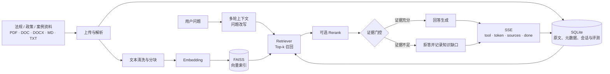

<p align="center">
  
</p>

<h1 align="center">LaborQA · 劳动权益咨询问答台</h1>

<p align="center">
  面向劳动权益场景的证据优先型 RAG 问答与知识运营平台
</p>

<p align="center">
  <code>Vue 3</code> · <code>FastAPI</code> · <code>LangChain</code> · <code>FAISS</code> · <code>SQLite</code> · <code>Docker Compose</code>
</p>

<p align="center">
  <a href="#快速开始">快速开始</a> ·
  <a href="#系统架构">系统架构</a> ·
  <a href="#配置指南">配置指南</a> ·
  <a href="#部署与运维">部署与运维</a> ·
  <a href="#文档索引">文档索引</a>
</p>

> [!IMPORTANT]
> LaborQA 是劳动权益信息辅助工具，不替代律师、仲裁机构、行政机关或其他专业人士提供的正式法律意见。回答的可靠性取决于已导入资料的完整性、时效性、检索配置和模型服务质量。

## 项目定位

LaborQA（Labor Rights QA）将法规、政策、案例和内部知识资料组织成可检索的证据库，让用户以自然语言完成劳动权益咨询。系统的核心原则不是“让模型尽量回答”，而是：

- **Evidence first**：回答必须建立在当前知识库检索到的证据上。
- **可追溯**：回答同步返回命中的文件、分块和原文片段，便于复核。
- **证据不足则拒答**：检索不到资料或证据相关性不足时，系统明确提示依据不足，并记录知识缺口。
- **可评测、可调优**：问答评测和检索实验共用真实链路，用指标支持配置决策。
- **本地可控**：业务数据、上传文件、SQLite 和 FAISS 索引默认保存在部署环境内。

## 核心能力

| 能力模块 | 解决的问题 | 已实现能力 |
| --- | --- | --- |
| 证据优先问答 | 如何让回答有依据、可复核 | 多轮会话、问题改写、Top-k 检索、可选重排、证据门控、来源片段、SSE 流式回答 |
| 劳动法规知识库 | 如何将资料变成可用知识 | 支持 PDF、DOC、DOCX、MD、TXT；异步导入、解析、清洗、分块、向量化；失败重导入；分块明细查看 |
| 咨询辅助工具 | 如何把回答落到行动 | 通俗解读 / 严谨条款两种回答风格、材料清单、合规提示、知识缺口沉淀 |
| 问答质量评测 | 如何知道回答是否可靠 | 内置单轮、多轮和拒答用例；支持正确性、拒答率、引用命中率等指标 |
| 检索策略实验 | 如何选择更合适的 RAG 参数 | 比较分块大小、重叠长度、Top-k、相似度阈值、重排开关和重排候选数；支持快速试跑与正式实验 |
| 运行状态与运维 | 如何发现服务和索引问题 | API、数据库、文档转换器、Embedding、向量索引和 LLM 配置状态检查；Docker 健康检查、备份与恢复 |

## 系统架构



### 一次问答的处理链路

1. **理解上下文**：读取当前会话最近几轮消息，必要时将省略表达改写成独立问题。
2. **召回候选证据**：使用当前 Embedding 和 FAISS 索引进行 Top-k 召回；SQLite 作为分块内容和来源元数据的权威数据源。
3. **调整证据顺序**：根据配置决定是否执行领域重排，并保留检索分数、重排分数和排名信息。
4. **执行证据门控**：综合空结果、相关性阈值和证据判断链，决定回答还是拒答。
5. **生成可读回答**：在证据范围内调用 OpenAI-compatible Chat Completions 服务；可选择通俗或严谨风格，并按规则附加合规提示。
6. **流式返回与落库**：通过 Server-Sent Events 推送工具结果、回答 token、来源和完成状态，同时保存会话消息与引用。

### 设计上的关键边界

- **SQLite 是业务真源，FAISS 是可重建索引**：文件、分块、来源、会话、评测和实验记录以 SQLite / 文件存储为准，向量索引只负责高效召回。
- **生产问答与评测 / 实验复用同一条 RAG 链路**：减少“评测路径和线上路径不一致”造成的误判。
- **配置变更会影响索引兼容性**：Embedding Provider、模型、归一化方式、分块参数变化后，旧索引可能不再兼容，需要重建知识库索引。

## 技术栈

| 层次 | 技术与职责 |
| --- | --- |
| Web 前端 | Vue 3、TypeScript、Vite、Vue Router、Pinia、Element Plus |
| API 服务 | Python 3.11+、FastAPI、Pydantic Settings、Uvicorn |
| RAG 编排 | LangChain 1.4.1 及相关集成包、Runnable / Retriever / Prompt / ChatModel / Embeddings / VectorStore |
| 文本处理 | `pypdf`、`python-docx`、`msdoc2docx`；部署环境提供 LibreOffice 作为旧版 DOC 转换能力 |
| 向量检索 | FAISS CPU；默认本地 `BAAI/bge-small-zh-v1.5`，也支持 OpenAI-compatible Embedding API |
| 生成模型 | OpenAI-compatible Chat Completions API |
| 持久化 | SQLite、本地原始文件存储、FAISS 生产索引与实验索引 |
| 交付方式 | 本地开发、Docker Compose + Nginx 单机部署 |

## 快速开始

### 环境要求

- Python 3.11 或更高版本
- Node.js 20.19 或更高版本
- npm（前端依赖通过 `package-lock.json` 锁定）
- 可访问的 OpenAI-compatible LLM 服务
- 使用本地 Embedding 时，首次运行需要下载模型；也可以切换到远程 Embedding API

### 1. 准备后端环境

在仓库根目录执行：

```bash
cp .env.example .env
python3.11 -m venv backend/.venv
backend/.venv/bin/python -m pip install -r backend/requirements.txt
```

编辑根目录 `.env`，至少配置 LLM 服务：

```dotenv
LLM_API_KEY=你的_API_Key
LLM_BASE_URL=https://你的服务地址/v1
LLM_MODEL=你的模型名称
```

默认使用本地 `BAAI/bge-small-zh-v1.5` 生成向量。首次使用前可以主动检查 Embedding：

```bash
cd backend
.venv/bin/python -m app.scripts.verify_embedding
```

如果使用远程 Embedding，将 `.env` 改为：

```dotenv
EMBEDDING_PROVIDER=api
EMBEDDING_API_KEY=你的_Embedding_API_Key
EMBEDDING_BASE_URL=https://你的服务地址/v1
EMBEDDING_API_MODEL=你的_Embedding_模型名称
```

### 2. 启动后端

在第一个终端运行：

```bash
cd backend
.venv/bin/uvicorn app.main:app --reload --host 127.0.0.1 --port 8000
```

后端入口：

| 地址 | 用途 |
| --- | --- |
| <http://127.0.0.1:8000> | API 服务 |
| <http://127.0.0.1:8000/docs> | Swagger UI |
| <http://127.0.0.1:8000/redoc> | ReDoc |
| <http://127.0.0.1:8000/api/health> | 服务健康检查 |

### 3. 启动前端

在第二个终端运行：

```bash
cd frontend
cp .env.example .env
npm ci
npm run dev
```

打开 <http://127.0.0.1:5173> 即可进入问答台。前端默认通过 `VITE_API_BASE_URL=http://127.0.0.1:8000/api` 访问后端。

### 4. 完成首次知识库初始化

仓库中的 `reference-data/documents/` 提供 8 份按主题整理的 Markdown 资料：

1. 劳动关系与劳动合同
2. 工资支付与加班
3. 工作时间与休息休假
4. 社会保险
5. 工伤保险与工伤认定
6. 劳动争议、调解、仲裁与诉讼衔接
7. 特殊劳动保护
8. 辅助案例与政策解读

这些文件是**源资料**，不会因为放在仓库中就自动进入知识库。首次使用建议：

1. 进入“资料管理”，选择 `reference-data/documents/` 下的文件上传。
2. 等待资料状态变为“成功”，确认分块数量和导入结果。
3. 回到问答页提问，并展开来源面板核对原文片段。
4. 在“问答评测”运行内置用例，确认回答、拒答和引用行为。
5. 在“检索实验”中比较策略前，先确保生产知识库已经完成初始化。

## 产品工作台

前端路由与用途如下：

| 页面 | 路径 | 说明 |
| --- | --- | --- |
| 问答台 | `/` | 多轮会话、流式回答、来源查看、回答风格切换和材料清单 |
| 系统状态 | `/system` | 查看 API、数据库、Embedding、索引和文档转换器状态 |
| 资料管理 | `/documents` | 上传、筛选、重导入、删除资料，查看导入状态和分块 |
| 知识缺口 | `/missing-knowledge` | 查看被证据门控拒答的问题，并维护补充资料线索 |
| 问答评测 | `/evaluations` | 管理评测用例、启动评测运行、查看逐题结果和汇总指标 |
| 检索实验 | `/retrieval-experiments` | 管理检索策略，试跑或创建多策略对比实验并导出结果 |

## 配置指南

完整配置和默认值以 [`.env.example`](.env.example) 为准。下面列出最影响运行行为的配置：

| 配置 | 默认值 | 作用 |
| --- | --- | --- |
| `LLM_API_KEY` / `LLM_BASE_URL` / `LLM_MODEL` | 空 | 配置回答生成、问题改写和证据判断所使用的模型服务 |
| `EMBEDDING_PROVIDER` | `local` | 使用本地模型或远程 Embedding API |
| `LOCAL_EMBEDDING_MODEL` | `BAAI/bge-small-zh-v1.5` | 本地向量模型名称 |
| `EMBEDDING_NORMALIZE` | `true` | 是否对向量进行归一化；变更后需要重建索引 |
| `CHUNK_SIZE` / `CHUNK_OVERLAP` | `600` / `100` | 文本分块大小和重叠长度；`CHUNK_OVERLAP` 必须小于 `CHUNK_SIZE` |
| `RAG_TOP_K` | `5` | 初始召回数量，范围为 1–20 |
| `RAG_SCORE_THRESHOLD` | `0.35` | 低于阈值时进入证据不足判断 |
| `RERANK_ENABLED` / `RERANK_TOP_N` | `false` / `5` | 是否启用重排，以及重排候选上限 |
| `DEFAULT_ANSWER_STYLE` | `plain` | 默认使用通俗解读；可选 `legal` 严谨条款风格 |
| `MAX_UPLOAD_SIZE_MB` | `20` | 后端单文件业务大小限制 |
| `DOC_PARSER_BACKEND` / `DOC_CONVERTER` | `package` / `libreoffice` | 文档解析和旧版 DOC 转换策略 |

配置校验规则：

- 当 `EMBEDDING_PROVIDER=api` 时，必须同时填写 `EMBEDDING_API_KEY`、`EMBEDDING_BASE_URL` 和 `EMBEDDING_API_MODEL`。
- 当 `RERANK_ENABLED=true` 时，`RERANK_TOP_N` 不能大于 `RAG_TOP_K`。
- 修改 Embedding 模型、Provider、归一化方式或分块参数后，旧 FAISS 索引可能与当前签名不兼容；请先备份，再重新导入资料或按部署流程重建索引。
- API Key、上传文件、数据库和生成的索引属于运行时数据，不要提交到 Git。

## API 入口

FastAPI 会自动生成完整 OpenAPI 契约，启动后访问 `/docs` 或 `/openapi.json`。常用接口分组如下：

| 分组 | 入口 | 说明 |
| --- | --- | --- |
| 健康检查 | `GET /api/health` | 返回数据库、索引、Embedding、DOC 转换器和 LLM 配置状态 |
| 对话 | `POST /api/sessions`、`POST /api/chat/stream` | 会话管理与 SSE 流式 RAG 问答 |
| 资料 | `/api/documents/*` | 上传、查询、重导入、删除资料及查看分块 |
| 辅助工具 | `POST /api/tools/material-checklist` | 生成咨询材料清单 |
| 评测 | `/api/evaluations/*` | 用例管理、评测运行和逐题结果 |
| 知识缺口 | `/api/missing-knowledge*` | 查看和维护证据不足的问题 |
| 检索实验 | `/api/retrieval-strategies*`、`/api/retrieval-experiments*` | 策略管理、快速试跑和正式实验 |

`/api/chat/stream` 返回 `text/event-stream`，正常流程包含以下事件：

```text
tool     可选，材料清单等工具执行结果
token    一个或多个回答片段
sources  命中的来源与证据分块
done     回答已持久化，包含 message_id 和 refused 状态
error    终止性错误事件
```

## 数据与目录约定

| 路径 | 内容 | 版本控制 |
| --- | --- | --- |
| `.env` | 本地运行配置和密钥 | 不提交 |
| `reference-data/documents/` | 随仓库维护的初始参考资料 | 提交 |
| `data/app.db` | SQLite 业务数据 | 不提交，需备份 |
| `data/faiss/production/` | 生产问答向量索引 | 不提交，需备份或重建 |
| `data/faiss/experiments/` | 检索实验隔离索引 | 不提交，可按实验生命周期清理 |
| `uploads/` | 用户上传的原始文件 | 不提交，需纳入备份 |
| `model-cache/` | HuggingFace / Sentence Transformers 模型缓存 | 不提交，可重新下载 |
| `backups/` | 备份包和恢复前快照 | 不提交，按运维策略保存 |

删除容器不会自动删除上述宿主机挂载目录；生产环境应将 `data/`、`uploads/` 和配置文件纳入访问控制与备份策略。

## 部署与运维

### Docker Compose 一键启动

服务器只需要安装 Docker Engine 和 Docker Compose v2：

```bash
cp deploy/.env.example deploy/.env
mkdir -p data uploads model-cache backups

# 编辑 deploy/.env，至少填写 LLM_API_KEY、LLM_BASE_URL、LLM_MODEL
docker compose config
docker compose up -d --build
docker compose ps
curl http://127.0.0.1/api/health
```

部署架构：

- `frontend`：Nginx 提供 Vue 静态资源，并将 `/api/*`、SSE 和 API 文档反向代理到后端。
- `backend`：运行 FastAPI、RAG 链路、文档解析、SQLite 和 FAISS。
- 宿主机默认只暴露前端 `80` 端口，后端 `8000` 仅在 Compose 内部网络访问。
- `data/`、`uploads/`、`model-cache/` 通过宿主机目录持久化。

常用运维命令：

```bash
docker compose logs -f --tail=200 backend
docker compose logs -f --tail=200 frontend
docker compose restart
docker compose stop
docker compose down
./deploy/backup.sh
./deploy/restore.sh backups/<时间戳>/laborqa-runtime.tar.gz
```

完整的首次部署、模型初始化、健康检查、备份、恢复、升级、回滚和故障排查流程见 [`deploy/README.md`](deploy/README.md)。生产环境如需公网访问，应在外层补充 HTTPS、身份认证、访问控制和密钥管理策略。

## 开发与验证

### 后端

```bash
cd backend
.venv/bin/python -m pip install -r requirements-dev.txt
.venv/bin/python -m pytest -q
.venv/bin/ruff check app tests
.venv/bin/ruff format --check app tests
```

### 前端

```bash
cd frontend
npm ci
npm test
npm run build
```

### 推荐验证顺序

1. `GET /api/health` 确认数据库、Embedding 和向量索引状态。
2. 上传一份最小资料，确认“成功”状态和分块可见。
3. 发起一条有明确依据的问题，核对流式回答和来源片段。
4. 发起一条知识库未覆盖的问题，确认系统拒答并记录知识缺口。
5. 运行评测用例，观察正确率、拒答率和引用命中率。
6. 变更检索参数后运行检索实验，避免直接覆盖生产配置。

## 常见问题排查

| 现象 | 优先检查 |
| --- | --- |
| 提示“知识库尚未就绪” | 是否已经在“资料管理”完成资料导入；`/api/health` 中 `vector_store` 是否为 `ready` |
| 提示“向量索引与当前 Embedding 配置不兼容” | 是否修改了 Embedding 模型、Provider、归一化方式或分块参数；备份后重新建立索引 |
| 提示“模型服务暂不可用” | `LLM_API_KEY`、`LLM_BASE_URL`、`LLM_MODEL` 是否完整，服务地址是否可访问 |
| 本地 Embedding 首次启动很慢 | 模型正在下载或加载；检查 `model-cache/`、网络和容器日志 |
| Docker 中流式回答一次性出现 | 检查 Nginx 的 `proxy_buffering off`、`proxy_cache off` 和超时配置，详见 [`frontend/nginx.conf`](frontend/nginx.conf) |
| 旧版 DOC 导入失败 | 检查 `DOC_PARSER_BACKEND`、LibreOffice 是否安装，以及 `/api/health` 中 `doc_converter` 状态 |
| 上传文件超过限制 | 后端 `MAX_UPLOAD_SIZE_MB` 与 Nginx `client_max_body_size` 需要同步调整 |

## 项目结构

```text
LaborQA/
├── backend/
│   ├── app/api/              # REST、SSE 与 OpenAPI 接口
│   ├── app/core/             # 配置、数据库、错误处理、日志
│   ├── app/rag/              # LangChain 链路、Embedding、分块、向量检索
│   ├── app/repositories/     # SQLite 数据访问
│   ├── app/services/         # 问答、资料、评测、实验、工具服务
│   ├── app/prompts/          # 回答、改写、证据判断与评测提示词
│   ├── app/scripts/          # Embedding 等运维检查脚本
│   ├── tests/                # 后端测试
│   ├── Dockerfile
│   └── requirements*.txt
├── frontend/
│   ├── src/views/            # 问答、资料、系统、评测、实验页面
│   ├── src/components/       # 聊天和资料管理组件
│   ├── src/api/              # 后端接口客户端
│   ├── public/assets/        # 品牌资源（含 brand-mark.png）
│   ├── tests/                # 前端测试
│   └── package.json
├── docs/                     # 需求、设计、接口、原型和测试数据
├── reference-data/           # 随仓库维护的可审阅参考资料
├── data/                     # 运行时 SQLite 与 FAISS 数据
├── uploads/                  # 运行时上传文件
├── deploy/                   # Docker 部署、备份与恢复脚本
├── compose.yaml
└── README.md
```

## 文档索引

- [产品需求文档](docs/劳动权益咨询问答台_需求文档v3.md)
- [系统设计与项目开发文档](docs/劳动权益咨询问答台_系统设计与项目开发文档v4.md)
- [前后端接口文档](docs/devdocs/劳动权益咨询问答台_前后端接口文档_详细设计版_v2.md)
- [模块详细设计](docs/devdocs/劳动权益咨询问答台_模块详细设计与功能逻辑_详细设计版_v2.md)
- [RAG 链路改造方案](docs/devdocs/LangChain_RAG链路改造方案.md)
- [参考资料说明](reference-data/README.md)
- [Docker 部署与运维](deploy/README.md)
- [前端原型图](docs/prototypes/)

## 贡献与资料维护

提交新的法规或政策资料前，请确认：

- 资料来源合法、可审阅，并记录来源、发布日期或版本变化。
- 不包含 API Key、个人隐私、真实咨询记录或其他敏感信息。
- 修改后重新导入并执行相关评测，确认引用和拒答行为没有明显退化。
- 如果调整 Embedding、分块、重排或阈值配置，补充实验结果和迁移说明。

## 许可证与使用边界

本仓库当前以项目内部开发和部署为主要场景。法律、政策和案例资料可能随时间变化，使用前应核对最新有效文本及适用范围；任何自动生成内容都应由具备相应能力的人员进行最终判断。
