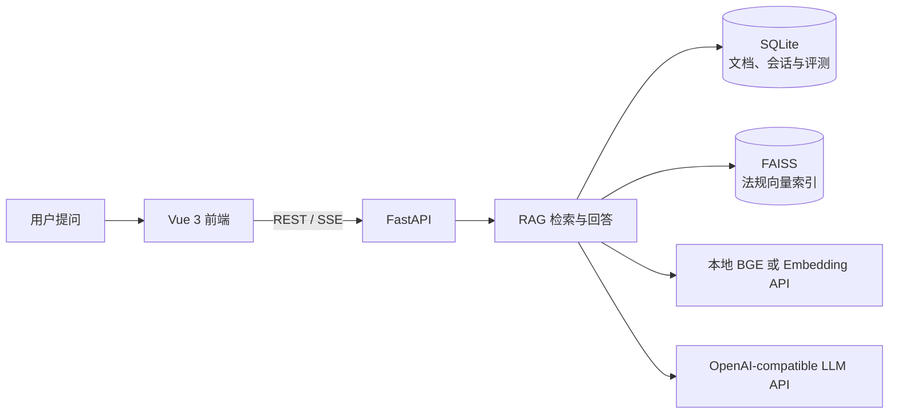

# 劳动权益咨询问答台

项目名：**LaborQA**（Labor Rights QA）。

一个基于检索增强生成（RAG）的劳动权益信息辅助工具。用户导入法规与政策资料后，可以用自然语言提问；系统检索知识库中的相关依据，生成回答并展示来源。资料不足时，系统会提示依据不足，不以模型常识替代法规证据。

> 本项目用于信息辅助，不替代律师或行政机关提供的正式法律意见。

## 功能

- **有据可查的问答**：支持多轮会话和流式回答，展示引用文件与原文片段，并可切换通俗解读或严谨条款风格。
- **劳动法规知识库**：导入 PDF、DOC、DOCX、TXT 文件，查看导入状态和文本片段；失败的资料可以重新导入。
- **咨询辅助**：提供材料清单工具、合规提示，并汇总知识库暂未覆盖的问题，便于补充资料。
- **回答质量评测**：通过预置用例查看回答正确率、拒答率和引用命中情况。
- **检索策略实验**：比较不同分块、召回数量和重排设置对检索与回答效果的影响。
- **运行状态检查**：查看 API、数据库、向量索引、Embedding、LLM 配置和旧版 DOC 解析状态。

## 工作方式



## 技术栈

| 部分 | 技术 |
| --- | --- |
| 前端 | Vue 3、TypeScript、Vite、Element Plus、Pinia |
| 后端 | Python 3.11+、FastAPI、Pydantic |
| RAG 编排 | LangChain `1.4.1`（集成包版本锁定在 `backend/requirements.txt`） |
| 关系数据与文件 | SQLite、本地文件存储 |
| 向量检索 | FAISS |
| 文本向量化 | 本地 `BAAI/bge-small-zh-v1.5`（默认），或 OpenAI-compatible Embedding API |
| 回答生成 | OpenAI-compatible Chat Completions API |

## 快速开始

### 环境要求

- Python 3.11 或更新版本
- Node.js 20.19 或更新版本
- 首次使用本地 BGE 模型时需要网络连接下载模型；也可以配置 Embedding API
- 配置可用的 LLM API，才能生成问答回复

### 配置后端

在仓库根目录创建本地配置文件并安装依赖：

```bash
cp .env.example .env
python3.11 -m venv backend/.venv
backend/.venv/bin/python -m pip install -r backend/requirements.txt
```

编辑根目录 `.env`，至少填写 LLM 服务的三个配置：

```dotenv
LLM_API_KEY=你的_API_Key
LLM_BASE_URL=https://你的服务地址/v1
LLM_MODEL=你的模型名称
```

默认 Embedding 使用本地 BGE 模型。可在后端目录运行一次编码检查，首次运行也会准备模型缓存：

```bash
cd backend
.venv/bin/python -m app.scripts.verify_embedding
```

如需使用远程 Embedding，在 `.env` 中设置 `EMBEDDING_PROVIDER=api`，并填写 `EMBEDDING_API_KEY`、`EMBEDDING_BASE_URL` 和 `EMBEDDING_API_MODEL`。完整配置项及默认值见 [`.env.example`](.env.example)。

### 启动后端

在一个终端中运行：

```bash
cd backend
.venv/bin/uvicorn app.main:app --reload --host 127.0.0.1 --port 8000
```

- 后端地址：<http://127.0.0.1:8000>
- 交互式 API 文档：<http://127.0.0.1:8000/docs>
- 健康检查：<http://127.0.0.1:8000/api/health>

### 启动前端

在另一个终端中运行：

```bash
cd frontend
cp .env.example .env
npm ci
npm run dev
```

前端地址：<http://127.0.0.1:5173>

## 首次使用

项目不附带已构建的法规知识库。打开“资料管理”上传可公开使用的劳动法规或政策资料，等待导入成功后，再从首页开始提问。RAG 请求通过 LangChain 的 Prompt、Runnable、Retriever、ChatModel、Embeddings 和 VectorStore 接口编排；SQLite 继续作为业务数据真源，FAISS 作为可重建向量索引，模型通过 `ChatOpenAI` 连接 OpenAI-compatible Chat Completions 服务。检索只回查当前 Top-k 命中的 Chunk，避免每次问答加载全部成功片段。PDF、DOCX 和 TXT 可直接解析；旧版 DOC 默认使用依赖中的 `msdoc2docx`，仅在该包不可用时回退到 LibreOffice。

后端启动时会自动初始化 SQLite 数据库，无需手动执行 SQL。默认数据位置如下：

| 内容 | 默认位置 |
| --- | --- |
| 本地配置 | 仓库根目录 `.env` |
| SQLite 数据库 | `data/app.db` |
| 上传的原始文件 | `uploads/` |
| 生产向量索引 | `data/faiss/production/` |
| 检索实验索引 | `data/faiss/experiments/` |

`.env`、上传文件和生成的数据目录已加入 Git 忽略规则；请勿将真实 API Key 提交到仓库。切换 Embedding Provider、模型、归一化方式或分块参数后，现有向量索引可能与新配置不兼容，恢复问答前需要重建索引。

## 项目结构

```text
backend/
  app/api/          REST、SSE 接口
  app/services/     文档处理、问答、检索、评测与实验服务
  app/repositories/ SQLite 数据访问
  app/core/         配置、数据库、错误与日志
  tests/            后端测试
frontend/
  src/views/        问答、资料、系统、评测与实验页面
  src/components/   页面组件
  src/api/          后端接口客户端
  tests/            前端测试
docs/               需求、系统设计与开发文档
data/               本地数据库与向量索引（运行时生成）
uploads/             上传的资料（运行时生成）
```

## 验证

后端检查：

```bash
cd backend
.venv/bin/python -m pip install -r requirements-dev.txt
.venv/bin/python -m pytest -q
.venv/bin/ruff check app tests
.venv/bin/ruff format --check app tests
```

前端检查：

```bash
cd frontend
npm test
npm run build
```

## 进一步阅读

- [产品需求](docs/劳动权益咨询问答台_需求文档v3.md)
- [系统设计](docs/劳动权益咨询问答台_系统设计与项目开发文档v4.md)
- [接口设计](docs/devdocs/劳动权益咨询问答台_前后端接口文档_详细设计版_v2.md)
- [模块设计](docs/devdocs/劳动权益咨询问答台_模块详细设计与功能逻辑_详细设计版_v2.md)
