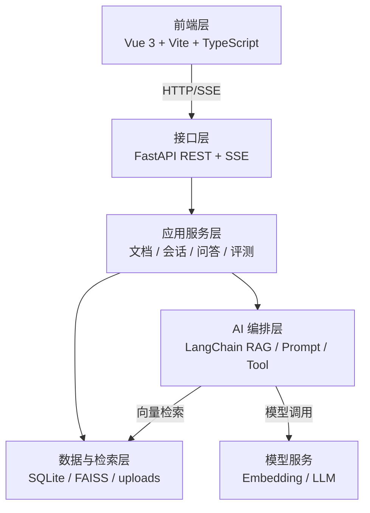
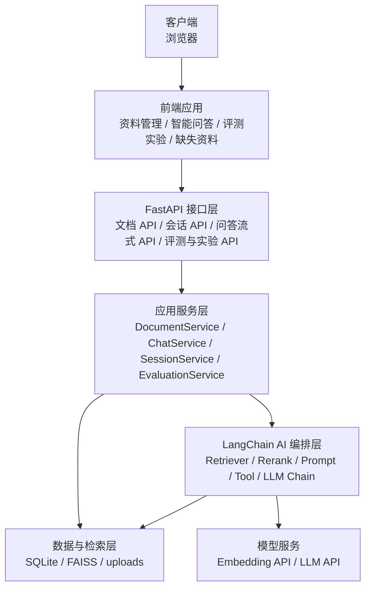
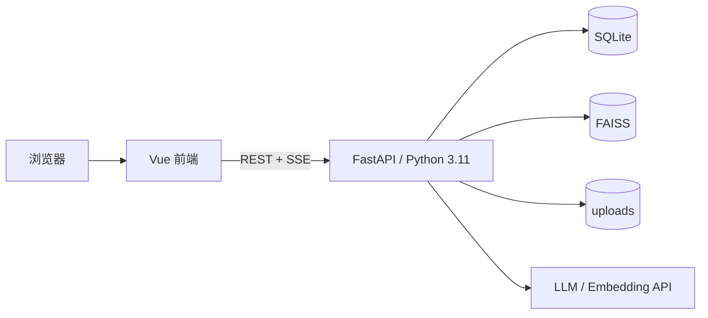
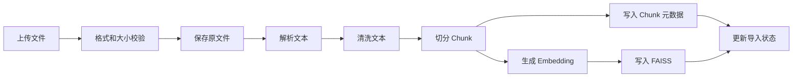
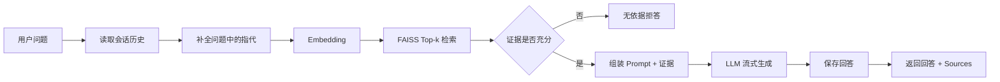
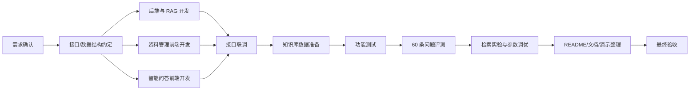

# 劳动权益咨询问答台——系统设计与项目开发文档

> 文档版本：1.0  
> 适用范围：劳动权益咨询问答台课程项目  
> 设计依据：项目任务书与需求文档

---

## 1. 文档说明

### 1.1 设计目标

本文档明确劳动权益咨询问答台的技术选型、系统架构、模块职责、核心接口、前后端交互方式、数据结构、RAG 流程、Prompt 约束、业务 Tool、部署环境、测试方案和项目开发规范。

### 1.2 设计原则

1. **证据优先**：所有劳动权益回答必须优先依赖知识库检索证据。
2. **可追溯**：回答中的来源能够追溯到原始文件和具体 Chunk。
3. **模块化**：前端、后端、RAG、数据层相互解耦，便于多人开发。
4. **轻量可运行**：课程项目优先选择本地可部署、依赖适中的技术方案。
5. **可调优**：Chunk、Top-k、相似度阈值、模型等关键参数全部配置化。
6. **可观测**：Tool、来源、导入状态、错误信息均能够在页面或日志中被观察。

---

## 2. 系统总体架构设计

### 2.1 技术选型

| 层次 | 技术方案 | 选型说明 |
|---|---|---|
| 前端 | Vue 3 + Vite + TypeScript | 组件化开发，适合两名前端成员并行开发；构建速度快，便于课程项目交付 |
| UI | Element Plus | 提供上传、表格、折叠面板、消息提示等常用组件，减少重复样式工作 |
| HTTP 客户端 | Axios / Fetch | 调用后端 REST 接口；流式接口使用 Fetch + SSE 解析 |
| 后端 | Python 3.11 + FastAPI | 提供接口开发、参数校验、异步处理与流式响应能力 |
| AI 编排 | LangChain | 统一组织 Retriever、Prompt、LLM、Tool 等组件 |
| 向量检索 | FAISS | 轻量、可本地运行，适合课程项目离线向量索引 |
| 关系数据 | SQLite | 保存文档元数据、会话、消息、引用、评测记录，部署成本低 |
| 文件存储 | 本地 `uploads/` | 保存原始公开法规文件 |
| 模型能力 | Embedding API + LLM API | Embedding 用于向量化，LLM 用于基于证据生成回答 |
| 流式输出 | FastAPI StreamingResponse / SSE | 实现回答逐段展示 |

### 2.2 架构风格

系统采用“**前后端分离 + 分层服务 + RAG AI 编排**”架构。



### 2.3 分层与模块划分

| 层 | 主要职责 | 典型模块 |
|---|---|---|
| 表现层 | 页面展示、用户输入、流式渲染、来源折叠 | UploadView、KnowledgeView、ChatView |
| API 层 | 参数校验、请求路由、统一返回、SSE | documents router、chat router、sessions router、evaluation router |
| 应用服务层 | 组织业务流程，协调数据与 AI | DocumentService、ChatService、SessionService、EvaluationService |
| AI 编排层 | 检索、Rerank、Prompt、LLM、Tool、问题重写 | RetrieverService、RerankService、RAGChain、PromptManager、MaterialChecklistTool |
| 数据访问层 | SQLite 访问、向量索引、文件管理 | repositories、FAISSStore、FileStorage |

### 2.4 系统架构图



### 2.5 部署与运行环境

系统开发与验收环境如下：

- Python：3.11.x；
- Node.js：20 LTS 或兼容版本；
- 浏览器：Chrome / Edge / Safari 最新稳定版；
- 数据库：SQLite 单文件数据库；
- 向量库：FAISS 本地索引文件；
- 操作系统：Windows、macOS、Linux 均可；
- 配置：`.env` 保存模型 API Key、模型名称、Embedding 配置等；
- 后端默认端口：`8000`；
- 前端开发端口：`5173`。



---

## 3. 系统模块详细设计

### 3.1 前端模块设计

#### 3.1.1 资料管理模块

主要页面与组件：

- `DocumentUpload.vue`：文件选择、上传、进度和结果提示；
- `DocumentList.vue`：文件名、类型、状态、片段数量、导入时间；
- `ChunkList.vue`：按文件加载知识片段；
- `ChunkDetail.vue`：查看单个片段原文。

关键交互：上传成功后刷新文件列表；导入处理中定时刷新状态或在用户操作时刷新；点击文件进入知识片段列表。

#### 3.1.2 智能问答模块

主要页面与组件：

- `ChatView.vue`：问答主页面；
- `MessageList.vue`：渲染用户消息与 AI 消息；
- `QuestionInput.vue`：问题输入、发送状态；
- `SourcePanel.vue`：来源文件、Chunk、原文、相关度；
- `ToolPanel.vue`：Tool 名称、入参、执行结果；
- `SessionHeader.vue`：新建会话与当前会话标识；
- `AnswerStyleSwitch.vue`：劳动者通俗版 / 严谨条款版切换；
- `MissingKnowledgeView.vue`：高频无依据问题与待补充资料清单；
- `EvaluationDashboard.vue`：60 条用例评测结果与指标；
- `RetrievalExperimentView.vue`：检索策略实验配置、执行与对比结果。

流式回答期间，前端逐步把 SSE 数据追加到当前 AI 消息；收到 `sources` 事件后再渲染引用信息；收到 `done` 事件后结束 loading 状态。

### 3.2 文档与知识库模块

#### 3.2.1 职责

1. 校验上传文件。
2. 保存原始文件。
3. 根据格式解析文本。
4. 清洗文本并切分 Chunk。
5. 为 Chunk 生成 Embedding。
6. 写入 FAISS 索引。
7. 将文档、Chunk 元数据保存到 SQLite。
8. 更新导入状态。

#### 3.2.2 核心类与接口

| 类/模块 | 职责 |
|---|---|
| `DocumentService` | 组织完整导入流程 |
| `FileParserFactory` | 根据 PDF/Word/TXT 选择解析器 |
| `TextChunker` | 文本切分与 overlap 处理 |
| `EmbeddingService` | 批量生成向量 |
| `VectorStoreService` | 创建、保存、加载 FAISS 索引 |
| `DocumentRepository` | 文档元数据 CRUD |
| `ChunkRepository` | Chunk 元数据 CRUD |

#### 3.2.3 文档导入流程



#### 3.2.4 Chunk 设计

Chunk 参数：

- `chunk_size`：600 中文字符左右；
- `chunk_overlap`：100 字符左右；
- 优先按条、款、自然段边界切分；
- 超长段落再按长度二次切分；
- 每个 Chunk 保存 `document_id`、`file_name`、`chunk_no`、`content`。

上述参数通过配置文件统一管理，并作为检索策略实验参数。

### 3.3 问答与 RAG 模块

#### 3.3.1 处理流程



#### 3.3.2 检索策略

检索配置：

- Top-k：默认 5，可配置 3 / 5 / 8 等实验值；
- Chunk：默认 600，可配置 400 / 600 / 800 等实验值；
- Rerank：默认关闭，支持开启交叉编码器或模型重排；
- 向量相似度：使用归一化向量配合内积/余弦相似度；
- 相关度阈值：默认 `0.35`，通过配置项管理，并根据评测结果调整；
- 返回给模型的上下文优先保留得分较高且不重复的片段；
- 无有效结果时不调用“自由回答”路径，直接进入拒答。

#### 3.3.3 多轮问题处理

对依赖前文的问题，系统读取当前会话最近三轮消息，并生成“当前独立问题”用于检索。例如：

- 上一轮：“试用期被辞退有补偿吗？”
- 当前轮：“那公司说我不符合录用条件呢？”
- 检索问题可重写为：“试用期内公司以劳动者不符合录用条件为由解除劳动关系时，是否需要补偿？”

原始问题与重写后的检索问题同时写入日志，用于检索效果分析。

### 3.4 Prompt 设计

Prompt 集中放置于 `app/prompts.py` 或 `app/prompts/` 目录，禁止散落在路由函数中。

系统 Prompt 核心约束：

```text
你是劳动权益咨询辅助系统。
你只能依据“检索到的法规与政策片段”回答。
如果证据不足，必须明确说明当前知识库未找到足够依据，不能使用常识补全法律结论。
回答按以下结构组织：
1. 适用情形/简要结论
2. 依据
3. 处理建议
如涉及具体维权路径或时效，补充“请咨询当地劳动监察部门或法律援助机构”。
不得虚构法规名称、条款编号、来源文件或原文。
```

模型生成答案时不自行生成 Sources 数据；来源信息由后端使用 Retriever 命中结果组装，以保证可追溯性。

### 3.5 会话模块

核心对象：`Session`、`Message`。

- 新建会话：创建 `session_id`；
- 发送问题：消息写入 `message` 表；
- 读取上下文：按时间排序读取当前会话最近消息；
- 新会话隔离：查询历史必须带 `session_id` 条件；
- 会话删除与归档不在本项目功能范围内。

### 3.6 业务 Tool 设计

本项目选择“**生成维权材料清单**”。

LangChain Tool 定义：

```python
@tool

def generate_rights_material_checklist(dispute_type: str, description: str) -> dict:
    """根据劳动争议类型和简要描述生成维权所需材料清单。"""
```

返回示例结构：

```json
{
  "tool_name": "generate_rights_material_checklist",
  "dispute_type": "欠薪",
  "materials": [
    "劳动合同或能够证明劳动关系的材料",
    "工资条、银行流水等工资支付记录",
    "考勤、排班或工作记录",
    "与用人单位沟通欠薪问题的记录"
  ],
  "note": "材料清单仅用于信息整理，具体以实际争议和受理机构要求为准。"
}
```

前端必须展示：工具名称、入参、执行结果。

### 3.7 评测模块

正式评测集固定为 **60 条**（40 条库内 + 20 条库外）。评测数据由 `evaluation_case`、`evaluation_run` 与 `evaluation_result` 三部分组成。

- `evaluation_case`：保存题目、主题、期望类型、期望答案要点、期望来源、多轮标记；
- `evaluation_run`：保存一次完整评测的运行批次、模型、Prompt 版本、Chunk 参数、Top-k、Rerank 状态等参数快照；
- `evaluation_result`：保存具体用例在某个运行批次下的回答、正确性、拒答、引用命中、耗时等结果。

核心指标：回答正确率、拒答率、引用命中率、多轮理解通过率、合规提示命中率。

### 3.8 应答风格模块

`AnswerStyleService` 与 Prompt 模板变量负责两种应答风格：

- `plain`：劳动者通俗版；
- `legal`：严谨条款版。

前端每次提问携带 `answer_style`。后端只改变 Prompt 的表达要求，不改变 Retriever 结果、拒答阈值和 Sources 组装逻辑。风格切换属于展示与组织方式切换，不允许成为绕过证据约束的路径。

### 3.9 高频无依据问题分析模块

`MissingKnowledgeService` 的处理流程如下：

1. 当 ChatService 判定拒答原因属于 `NO_RETRIEVAL_RESULT`、`LOW_RELEVANCE` 或 `INSUFFICIENT_EVIDENCE` 时记录缺失问题；
2. 对问题进行标准化（去除口语填充、保留核心争议主题）；
3. 按相似问题聚类或主题键聚合；
4. 更新出现次数、最近出现时间和典型问题；
5. 向前端提供“待补充资料”列表；
6. 资料补充后可将条目标记为已补充，并关联复测结果。

### 3.10 检索策略实验模块

`RetrievalExperimentService` 统一管理实验矩阵和运行结果。每个实验配置至少包含：

- `chunk_size`；
- `chunk_overlap`；
- `top_k`；
- `rerank_enabled`；
- `score_threshold`；
- 使用的 Embedding 模型与 Rerank 模型（如有）。

实验固定使用同一批评测用例，输出正确率、拒答率、引用命中率和平均检索耗时，并根据主指标确定最优配置。不同 Chunk 配置使用独立索引目录，避免实验数据相互覆盖。


---

## 4. 系统功能与接口设计

### 4.1 统一接口约定

普通 REST 接口统一返回：

```json
{
  "code": 0,
  "message": "success",
  "data": {}
}
```

错误时使用非零业务码，并返回可以理解的错误说明。流式回答接口使用 SSE，不套普通 JSON 外壳。

### 4.2 核心 API 清单

| 方法 | 路径 | 功能 | 主要入参 | 主要返回 |
|---|---|---|---|---|
| POST | `/api/documents/upload` | 上传法规资料 | multipart file | document_id、status |
| GET | `/api/documents` | 文件列表 | page、size | 文件列表 |
| GET | `/api/documents/{id}` | 文件详情 | id | 文档元数据 |
| GET | `/api/documents/{id}/chunks` | 查看片段 | id、page、size | Chunk 列表 |
| POST | `/api/sessions` | 新建会话 | title（非必填） | session_id |
| GET | `/api/sessions/{id}/messages` | 会话消息 | session_id | 历史消息 |
| POST | `/api/chat/stream` | 流式问答 | session_id、question | SSE 事件流 |
| POST | `/api/tools/material-checklist` | 直接测试 Tool | dispute_type、description | Tool 执行结果 |
| GET | `/api/evaluations/cases` | 测试问题列表 | - | case 列表 |
| POST | `/api/evaluations/run` | 执行评测 | case_ids | 评测结果与指标 |
| GET | `/api/evaluations/runs` | 评测批次列表 | page、size | 批次与指标 |
| GET | `/api/missing-knowledge` | 高频无依据问题列表 | status、page、size | 缺失主题列表 |
| PATCH | `/api/missing-knowledge/{id}` | 更新缺失项状态 | status、note | 更新结果 |
| POST | `/api/retrieval-experiments` | 创建并运行检索实验 | 参数组合、case_ids | experiment_id |
| GET | `/api/retrieval-experiments/{id}` | 获取实验结果 | id | 对比表、指标、最优配置 |

### 4.3 流式问答事件设计

SSE 事件类型：

```text
event: token
data: {"content":"根据你描述的情况..."}

event: sources
data: {"items":[...]}

event: tool
data: {"name":"generate_rights_material_checklist","input":{},"output":{}}

event: done
data: {"message_id": 101,"answer_style":"plain"}
```

异常时：

```text
event: error
data: {"code":"MODEL_UNAVAILABLE","message":"模型服务暂时不可用"}
```

### 4.4 前后端交互说明

#### 文件上传

1. 前端提交 `multipart/form-data`；
2. 后端创建文档记录并进入 `PROCESSING`；
3. 后端解析、切分、索引；
4. 成功后更新为 `SUCCESS`，失败更新为 `FAILED` 并保存错误摘要；
5. 前端刷新列表显示状态。

#### 问答

1. 前端确保当前存在 `session_id`；
2. 调用 `/api/chat/stream`；
3. 后端保存用户消息；
4. 执行检索与证据判断；
5. 有依据则流式生成，无依据则流式返回拒答；
6. 前端实时更新消息文本；
7. `sources` 事件到达后渲染来源面板；
8. 完成后后端保存 AI 消息和引用记录。

---

## 5. 数据设计

### 5.1 数据存储总体方案

系统采用“SQLite 结构化数据 + FAISS 向量索引 + 本地文件”的混合持久化方式：

- SQLite：保存可查询、有关联关系的业务数据；
- FAISS：保存 Chunk Embedding 对应的向量索引；
- `uploads/`：保存原始法规文件；
- FAISS 与 SQLite 通过 `chunk.id` / `vector_key` 建立映射。

### 5.2 ER 图

```mermaid
erDiagram
    DOCUMENT ||--o{ CHUNK : contains
    SESSION ||--o{ MESSAGE : contains
    MESSAGE ||--o{ CITATION : has
    CHUNK ||--o{ CITATION : referenced_by
    MESSAGE ||--o{ TOOL_EXECUTION : triggers
    EVALUATION_CASE ||--o{ EVALUATION_RESULT : produces

    DOCUMENT {
      int id PK
      string file_name
      string file_type
      string file_path
      string status
      int chunk_count
      datetime created_at
    }
    CHUNK {
      int id PK
      int document_id FK
      int chunk_no
      text content
      string vector_key
      datetime created_at
    }
    SESSION {
      string id PK
      string title
      datetime created_at
      datetime updated_at
    }
    MESSAGE {
      int id PK
      string session_id FK
      string role
      text content
      datetime created_at
    }
    CITATION {
      int id PK
      int message_id FK
      int chunk_id FK
      float score
    }
    TOOL_EXECUTION {
      int id PK
      int message_id FK
      string tool_name
      text input_json
      text output_json
      datetime created_at
    }
    EVALUATION_CASE {
      int id PK
      text question
      string expected_type
      text expected_answer
    }
    EVALUATION_RESULT {
      int id PK
      int case_id FK
      text answer
      bool correct
      bool refused
      datetime created_at
    }
```



### 5.3 数据表清单

| 表名 | 用途 |
|---|---|
| `document` | 保存上传法规文件及导入状态 |
| `chunk` | 保存文档切分片段及来源关系 |
| `session` | 保存问答会话 |
| `message` | 保存用户和 AI 消息 |
| `citation` | 保存 AI 回答与引用 Chunk 的对应关系 |
| `tool_execution` | 保存 Tool 调用信息 |
| `evaluation_case` | 保存测试问题 |
| `evaluation_result` | 保存评测运行结果 |
| `evaluation_run` | 保存一次评测运行的参数快照与汇总指标 |
| `missing_knowledge` | 保存高频无依据主题及待补充资料状态 |
| `retrieval_experiment` | 保存检索策略实验配置与汇总结果 |
| `retrieval_experiment_result` | 保存实验中各用例的检索与指标结果 |

### 5.4 数据字典

#### 5.4.1 `document`

| 字段 | 类型 | 键/约束 | 默认值 | 说明 |
|---|---|---|---|---|
| `id` | INTEGER | PK, AUTOINCREMENT | - | 文档主键 |
| `file_name` | VARCHAR(255) | NOT NULL | - | 原始文件名 |
| `file_type` | VARCHAR(20) | NOT NULL | - | pdf/doc/docx/txt |
| `file_path` | VARCHAR(500) | NOT NULL | - | 服务端存储路径 |
| `status` | VARCHAR(20) | NOT NULL | PROCESSING | PROCESSING/SUCCESS/FAILED |
| `chunk_count` | INTEGER | NOT NULL | 0 | 成功生成片段数 |
| `error_message` | VARCHAR(500) | NULL | NULL | 导入失败摘要 |
| `created_at` | DATETIME | NOT NULL | CURRENT_TIMESTAMP | 创建时间 |
| `updated_at` | DATETIME | NOT NULL | CURRENT_TIMESTAMP | 更新时间 |

#### 5.4.2 `chunk`

| 字段 | 类型 | 键/约束 | 默认值 | 说明 |
|---|---|---|---|---|
| `id` | INTEGER | PK, AUTOINCREMENT | - | Chunk 主键 |
| `document_id` | INTEGER | FK -> document.id, NOT NULL | - | 所属文档 |
| `chunk_no` | INTEGER | NOT NULL | - | 文档内片段序号 |
| `content` | TEXT | NOT NULL | - | 原文片段 |
| `vector_key` | VARCHAR(100) | UNIQUE | - | 与 FAISS 映射的键 |
| `created_at` | DATETIME | NOT NULL | CURRENT_TIMESTAMP | 创建时间 |

约束：`(document_id, chunk_no)` 建立唯一索引。

#### 5.4.3 `session`

| 字段 | 类型 | 键/约束 | 默认值 | 说明 |
|---|---|---|---|---|
| `id` | VARCHAR(36) | PK | UUID | 会话 ID |
| `title` | VARCHAR(100) | NULL | NULL | 会话标题，可取首个问题摘要 |
| `created_at` | DATETIME | NOT NULL | CURRENT_TIMESTAMP | 创建时间 |
| `updated_at` | DATETIME | NOT NULL | CURRENT_TIMESTAMP | 最近更新时间 |

#### 5.4.4 `message`

| 字段 | 类型 | 键/约束 | 默认值 | 说明 |
|---|---|---|---|---|
| `id` | INTEGER | PK, AUTOINCREMENT | - | 消息主键 |
| `session_id` | VARCHAR(36) | FK -> session.id, NOT NULL | - | 所属会话 |
| `role` | VARCHAR(20) | NOT NULL | - | user/assistant |
| `content` | TEXT | NOT NULL | - | 消息正文 |
| `rewritten_question` | TEXT | NULL | NULL | 多轮场景下重写后的检索问题 |
| `created_at` | DATETIME | NOT NULL | CURRENT_TIMESTAMP | 创建时间 |

#### 5.4.5 `citation`

| 字段 | 类型 | 键/约束 | 默认值 | 说明 |
|---|---|---|---|---|
| `id` | INTEGER | PK, AUTOINCREMENT | - | 引用主键 |
| `message_id` | INTEGER | FK -> message.id, NOT NULL | - | AI 回答消息 |
| `chunk_id` | INTEGER | FK -> chunk.id, NOT NULL | - | 被引用 Chunk |
| `score` | REAL | NOT NULL | 0 | 检索相关度 |
| `rank_no` | INTEGER | NOT NULL | 0 | 当前回答中的排序 |

#### 5.4.6 `tool_execution`

| 字段 | 类型 | 键/约束 | 默认值 | 说明 |
|---|---|---|---|---|
| `id` | INTEGER | PK, AUTOINCREMENT | - | Tool 执行记录主键 |
| `message_id` | INTEGER | FK -> message.id, NULL | NULL | 关联回答消息 |
| `tool_name` | VARCHAR(100) | NOT NULL | - | Tool 名称 |
| `input_json` | TEXT | NOT NULL | `{}` | 入参 JSON |
| `output_json` | TEXT | NOT NULL | `{}` | 执行结果 JSON |
| `created_at` | DATETIME | NOT NULL | CURRENT_TIMESTAMP | 执行时间 |

#### 5.4.7 `evaluation_case`

| 字段 | 类型 | 键/约束 | 默认值 | 说明 |
|---|---|---|---|---|
| `id` | INTEGER | PK, AUTOINCREMENT | - | 测试用例主键 |
| `question` | TEXT | NOT NULL | - | 测试问题 |
| `expected_type` | VARCHAR(20) | NOT NULL | - | ANSWER/REJECT |
| `expected_answer` | TEXT | NULL | NULL | 库内问题的期望要点 |
| `expected_source` | VARCHAR(255) | NULL | NULL | 期望来源（非必填） |
| `topic` | VARCHAR(50) | NULL | NULL | 工资/加班/社保/工伤等主题 |
| `is_multi_turn` | BOOLEAN | NOT NULL | 0 | 是否属于多轮测试 |
| `should_show_compliance` | BOOLEAN | NOT NULL | 0 | 是否期望出现合规提示 |

#### 5.4.8 `evaluation_result`

| 字段 | 类型 | 键/约束 | 默认值 | 说明 |
|---|---|---|---|---|
| `id` | INTEGER | PK, AUTOINCREMENT | - | 评测结果主键 |
| `run_id` | INTEGER | FK -> evaluation_run.id, NOT NULL | - | 所属评测批次 |
| `case_id` | INTEGER | FK -> evaluation_case.id, NOT NULL | - | 对应测试问题 |
| `answer` | TEXT | NOT NULL | - | 系统实际回答 |
| `correct` | BOOLEAN | NOT NULL | 0 | 是否判定正确 |
| `refused` | BOOLEAN | NOT NULL | 0 | 是否发生拒答 |
| `source_hit` | BOOLEAN | NOT NULL | 0 | 是否命中期望引用 |
| `multi_turn_correct` | BOOLEAN | NULL | NULL | 多轮理解是否正确 |
| `compliance_hit` | BOOLEAN | NULL | NULL | 合规提示是否正确出现 |
| `latency_ms` | INTEGER | NULL | NULL | 单题总耗时 |
| `created_at` | DATETIME | NOT NULL | CURRENT_TIMESTAMP | 评测时间 |


### 5.4.9 `evaluation_run`

| 字段 | 类型 | 说明 |
|---|---|---|
| `id` | INTEGER PK | 评测批次 |
| `name` | VARCHAR(100) | 批次名称 |
| `case_count` | INTEGER | 运行用例数 |
| `config_json` | TEXT | 模型、Prompt、Chunk、Top-k、Rerank 等参数快照 |
| `accuracy` | REAL | 回答正确率 |
| `reject_rate` | REAL | 拒答率 |
| `citation_hit_rate` | REAL | 引用命中率 |
| `created_at` | DATETIME | 创建时间 |

### 5.4.10 `missing_knowledge`

| 字段 | 类型 | 说明 |
|---|---|---|
| `id` | INTEGER PK | 主键 |
| `topic_key` | VARCHAR(100) | 归一化主题键 |
| `sample_question` | TEXT | 典型问题 |
| `count` | INTEGER | 出现次数 |
| `missing_area` | VARCHAR(255) | 缺失资料方向 |
| `status` | VARCHAR(20) | PENDING/RESOLVED/IGNORED |
| `first_seen_at` | DATETIME | 首次出现 |
| `last_seen_at` | DATETIME | 最近出现 |

### 5.4.11 `retrieval_experiment`

| 字段 | 类型 | 说明 |
|---|---|---|
| `id` | INTEGER PK | 实验主键 |
| `name` | VARCHAR(100) | 实验名称 |
| `config_json` | TEXT | Chunk、Top-k、Rerank 等参数 |
| `case_count` | INTEGER | 用例数 |
| `accuracy` | REAL | 正确率 |
| `reject_rate` | REAL | 拒答率 |
| `citation_hit_rate` | REAL | 引用命中率 |
| `avg_retrieval_ms` | REAL | 平均检索耗时 |
| `created_at` | DATETIME | 创建时间 |

### 5.4.12 `retrieval_experiment_result`

保存每个实验下每个测试用例的检索排名、命中 Chunk、是否命中期望引用、检索耗时与最终回答判定，用于复现实验和定位参数变化带来的差异。

---

## 6. 后端工程设计

### 6.1 后端目录结构

```text
backend/
├── app/
│   ├── main.py
│   ├── api/
│   │   ├── documents.py
│   │   ├── sessions.py
│   │   ├── chat.py
│   │   └── evaluations.py
│   ├── services/
│   │   ├── document_service.py
│   │   ├── chat_service.py
│   │   ├── session_service.py
│   │   ├── retrieval_service.py
│   │   └── evaluation_service.py
│   ├── rag/
│   │   ├── chunker.py
│   │   ├── embeddings.py
│   │   ├── vector_store.py
│   │   ├── reranker.py
│   │   └── chain.py
│   ├── tools/
│   │   └── material_checklist.py
│   ├── prompts/
│   │   ├── labor_consulting.py
│   │   └── styles.py
│   ├── repositories/
│   ├── models/
│   ├── schemas/
│   ├── core/
│   │   ├── config.py
│   │   ├── errors.py
│   │   └── logging.py
│   └── utils/
├── data/
│   ├── app.db
│   └── faiss/
├── uploads/
├── tests/
├── .env.example
└── requirements.txt
```

### 6.2 配置项

`.env.example` 至少包含：

```text
LLM_API_KEY=
LLM_BASE_URL=
LLM_MODEL=
EMBEDDING_MODEL=
DATABASE_URL=sqlite:///./data/app.db
UPLOAD_DIR=./uploads
FAISS_DIR=./data/faiss
RAG_TOP_K=5
RAG_SCORE_THRESHOLD=0.35
RERANK_ENABLED=false
RERANK_TOP_N=5
DEFAULT_ANSWER_STYLE=plain
CHUNK_SIZE=600
CHUNK_OVERLAP=100
```

`RAG_SCORE_THRESHOLD` 默认值为 `0.35`，通过评测结果进行校准并写入部署配置。

---

## 7. 前端工程设计

### 7.1 前端目录结构

```text
frontend/
├── src/
│   ├── api/
│   │   ├── documents.ts
│   │   ├── chat.ts
│   │   ├── sessions.ts
│   │   ├── evaluations.ts
│   │   ├── missingKnowledge.ts
│   │   └── experiments.ts
│   ├── components/
│   │   ├── documents/
│   │   ├── chat/
│   │   └── common/
│   ├── views/
│   │   ├── DocumentsView.vue
│   │   ├── ChatView.vue
│   │   ├── EvaluationView.vue
│   │   ├── MissingKnowledgeView.vue
│   │   └── RetrievalExperimentView.vue
│   ├── stores/
│   │   └── session.ts
│   ├── router/
│   ├── types/
│   ├── App.vue
│   └── main.ts
├── .env.example
└── package.json
```

### 7.2 前端成员模块边界

前端按业务模块拆分为：

- **资料管理前端**：资料上传、文件列表、导入状态、知识片段列表与原文查看；
- **智能问答前端**：问答页面、消息展示、流式回答、多轮会话、新建会话、来源面板、Tool 面板。

公共的 API 类型、基础布局和组件规范由组内统一约定。

资料管理前端同时负责“待补充资料”页面；智能问答前端同时负责应答风格切换、评测仪表盘与检索实验页面。两名前端成员均提交实际业务代码。

---

## 8. 异常处理与安全设计

### 8.1 主要异常

| 异常场景 | 处理方式 |
|---|---|
| 不支持的文件格式 | 上传接口直接拒绝，返回 `UNSUPPORTED_FILE_TYPE` |
| 文档解析失败 | 文档状态置为 FAILED，保存错误摘要 |
| FAISS 索引不存在 | 返回知识库未初始化提示，不进入自由回答 |
| 模型 API 超时 | 中断流式响应并发送 error 事件 |
| 会话不存在 | 返回 `SESSION_NOT_FOUND` |
| 检索无有效结果 | 返回业务拒答，不视为系统异常 |
| Tool 参数缺失 | 参数校验失败并返回可读提示 |

### 8.2 安全设计

- 文件名使用服务端生成的安全名称存储；
- 限制上传扩展名和 MIME 类型；
- API Key 只保存在服务端环境变量中；
- 对前端输入做长度限制；
- 不向前端返回完整异常堆栈；
- 对 Prompt 注入类输入仍以“只能根据检索证据回答”为最高业务约束；
- 项目页面固定展示“本系统用于信息辅助，不替代正式法律意见”的说明。

---

## 9. 测试与评测设计

### 9.1 功能测试重点

1. PDF/Word/TXT 文件上传是否成功；
2. 文件是否被切分且能查看原文；
3. 库内问题是否能返回有依据的回答；
4. 来源文件和原文是否与 Retriever 命中一致；
5. 流式内容是否按顺序展示；
6. 连续三轮及以上追问是否能够理解上下文；
7. 新建会话是否隔离历史；
8. 库外问题是否拒答；
9. 合规提示是否在适用场景出现；
10. Tool 名称、入参、结果是否展示完整；
11. 两种应答风格是否都能正常返回且不改变证据来源；
12. 拒答问题是否进入高频无依据统计；
13. 待补充资料状态是否可维护；
14. 60 条评测是否可按批次执行与保存；
15. Chunk、Top-k、Rerank 实验是否能得到可比较结果。

### 9.2 正式评测集设计

正式评测集使用 60 条固定测试用例：

| 类型 | 数量 | 目的 |
|---|---:|---|
| 库内单轮问题 | 30 | 验证正确率与引用命中 |
| 库内多轮问题 | 10 | 验证上下文与指代处理 |
| 库外/证据不足问题 | 20 | 验证拒答率与缺失资料记录 |
| 合计 | 60 | 固定评测规模 |

### 9.3 核心量化指标

- 回答正确率；
- 无依据问题拒答率；
- 引用命中率；
- 多轮理解通过率；
- 合规提示命中率；
- 平均检索耗时（实验指标）。

### 9.4 检索策略实验矩阵

至少完成以下基线实验：

| 实验组 | Chunk Size | Top-k | Rerank | 目的 |
|---|---:|---:|---|---|
| A（基线） | 600 | 5 | 关闭 | 默认配置 |
| B | 400 | 5 | 关闭 | 比较更细粒度切块 |
| C | 800 | 5 | 关闭 | 比较更粗粒度切块 |
| D | 600 | 3 | 关闭 | 比较较小候选集 |
| E | 600 | 8 | 关闭 | 比较较大候选集 |
| F | 600 | 5 | 开启 | 比较 Rerank 效果 |

实验结果以引用命中率和回答正确率为主指标，同时统计拒答率与耗时，并确定最终检索参数。

### 9.5 验收演示流程

验收演示按以下顺序进行：

1. 上传三种格式法规资料；
2. 查看导入状态与 Chunk 原文；
3. 提问库内问题并查看流式回答与来源；
4. 连续追问至少三轮；
5. 新建会话验证上下文隔离；
6. 提问库外问题验证拒答；
7. 触发生成维权材料清单 Tool；
8. 同一问题切换两种回答风格；
9. 展示 60 条评测集与三项核心指标；
10. 展示高频无依据问题和待补充资料清单；
11. 展示检索策略实验对比表和最优配置结论。

---

## 10. 项目开发与联调流程



开发过程先确定 API 数据结构，两名前端成员分别开发不同页面模块，后端提供 Mock 数据与接口示例，并在接口稳定后完成联调。

---

## 11. 最终交付结构

```text
劳动权益咨询问答台/
├── frontend/
├── backend/
├── knowledge_base/
│   └── 公开法规资料/
├── evaluation/
│   ├── test_cases_60.json
│   ├── evaluation_runs.json
│   ├── retrieval_experiments.json
│   └── missing_knowledge.json
├── docs/
│   ├── 需求文档.docx
│   └── 系统设计与项目开发文档.docx
├── .env.example
├── README.md
└── requirements.txt
```

最终成果应保证：按照 README 在新的环境中能够完成依赖安装、配置、启动前后端，并完整演示“资料导入 → 知识库检索 → 问答 → 来源回查 → 多轮追问 → 无依据拒答 → Tool 展示 → 双应答风格 → 60 条测试评测 → 高频缺失资料归纳 → 检索策略实验”的完整闭环。
