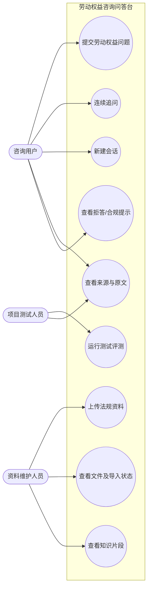
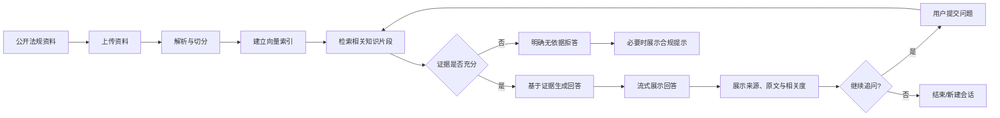

# 劳动权益咨询问答台——需求文档

---

## 1. 引言

### 1.1 项目背景（问题定义）

劳动者在工资、加班、离职、社保、工伤等场景中经常遇到权益判断问题，但劳动法规条款数量多、表达专业、适用条件复杂，普通使用者往往难以快速定位与自身问题直接相关的规定。传统搜索方式通常只能返回大量网页或完整法规文件，使用者仍需要自行阅读、比对并判断条款是否适用。

本项目拟建设“劳动权益咨询问答台”，将公开的劳动法规与政策资料整理为可检索知识库。用户使用自然语言描述问题后，系统从知识库中检索相关法规片段，并基于检索到的证据组织回答，同时展示来源文件、原文片段和相关度。对于知识库没有覆盖、检索结果不足或相关度过低的问题，系统必须明确说明“未找到足够依据”，不得仅依赖大模型常识生成看似合理但无法追溯的结论。

### 1.2 项目目标

1. 建立一个可导入公开劳动法规与政策资料的本地知识库。
2. 支持 PDF、Word、TXT 等资料的上传、解析、切分、索引与状态查看。
3. 支持自然语言劳动权益问答，并返回结构化回答。
4. 每个回答均能够追溯到具体来源文件和原文片段。
5. 支持不少于三轮的连续追问，能够理解依赖前文的指代。
6. 对无依据问题进行可靠拒答，并在涉及维权路径与时效时给出合规提示。
7. 通过测试集对回答正确率与无依据问题拒答率进行量化评测。

### 1.3 开发意义

本项目的开发意义主要体现在三个方面：

- **降低法规检索门槛**：用户不需要掌握法规名称、条款编号或专业检索语法，只需描述真实问题即可获取相关依据。
- **提高回答可解释性**：系统不只给结论，还同时展示引用来源和原文片段，便于用户自行核验。
- **训练可信 RAG 应用开发能力**：项目覆盖资料处理、向量检索、Prompt 约束、多轮会话、流式输出、Tool、评测等典型 AI 应用工程能力。

### 1.4 参考资料与术语说明

| 术语 | 说明 |
|---|---|
| RAG | Retrieval-Augmented Generation，检索增强生成。先从知识库检索证据，再由模型基于证据生成回答。 |
| Chunk | 文档切分后的最小知识片段，每个片段需保存来源文件名与片段序号等元数据。 |
| Embedding | 将文本转换为向量表示，用于计算问题与知识片段之间的语义相似度。 |
| Top-k | 一次检索返回的最相关知识片段数量。 |
| Prompt | 发送给大模型的业务提示词，用于约束角色、任务范围、输出格式和拒答规则。 |
| Tool | 由 LangChain 管理的业务工具。系统可根据问题触发工具，并展示工具名称、入参及执行结果。 |
| SSE | Server-Sent Events，服务端向浏览器持续推送文本数据的一种方式，可用于实现流式回答。 |
| 拒答 | 当知识库无可用证据时，系统明确说明无法依据当前资料回答，而不是自行补全内容。 |

---

## 2. 用户需求分析

### 2.1 系统使用对象

任务书未要求实现完整的账号登录与权限认证，因此本项目在需求阶段采用“逻辑角色”划分，不额外引入复杂的用户体系。

| 角色 | 身份说明 | 主要权限 | 主要操作 |
|---|---|---|---|
| 咨询用户 | 使用系统查询劳动权益问题的普通用户 | 使用问答与会话功能；查看回答依据 | 提交问题、连续追问、新建会话、查看来源、查看原文、查看合规提示 |
| 资料维护人员 | 负责准备与维护公开法规资料的项目使用者 | 使用资料与知识库管理功能 | 上传资料、查看导入状态、查看文件列表、查看知识片段、检查知识库内容 |
| 项目测试人员 | 对系统回答质量进行验证的项目成员 | 使用问答与评测功能 | 运行测试问题、记录正确率、检查拒答、检查来源引用 |

### 2.2 用户主要诉求

咨询用户最关心的是“回答是否和自己的问题相关、有没有法规依据、依据是否能看见、没有依据时系统会不会乱说”。资料维护人员最关心的是“资料能否成功导入、导入后是否被正确切分、每个片段能否追溯到原文件”。测试人员最关心的是“系统是否能稳定复现测试结果，并统计正确率、拒答率等指标”。

### 2.3 系统用例图

### 2.4 典型业务流程

### 2.5 典型使用场景

**场景一：查询加班工资问题。** 用户输入“公司要求周末加班但不给加班费怎么办”。系统检索知识库后返回适用情形、相关依据和处理建议，并在回答下方展示命中的法规文件、原文片段及相关度。

**场景二：连续追问。** 用户第一轮询问“试用期被辞退有没有补偿”，第二轮继续询问“那如果公司说我不符合录用条件呢”，第三轮询问“我需要准备什么材料”。系统需要结合前文理解“公司”“试用期被辞退”等指代，不应把第三轮当成完全独立问题。

**场景三：知识库外问题。** 用户询问与当前导入法规无关或证据不足的问题。系统应明确提示“当前知识库未找到足够依据”，不得由模型自行补全法律结论。

---

## 3. 功能需求分析

### 3.1 功能结构

```mermaid
flowchart TB
    S[劳动权益咨询问答台]
    S --> A[资料管理]
    S --> B[知识库管理]
    S --> C[权益问答]
    S --> D[会话管理]
    S --> E[依据与合规]
    S --> F[业务 Tool]
    S --> G[测试评测]

    A --> A1[资料上传]
    A --> A2[文件列表]
    A --> A3[导入状态]

    B --> B1[文档解析]
    B --> B2[知识切分]
    B --> B3[向量索引]
    B --> B4[片段查看]

    C --> C1[自然语言提问]
    C --> C2[RAG 检索]
    C --> C3[分点回答]
    C --> C4[流式输出]

    D --> D1[多轮追问]
    D --> D2[上下文保持]
    D --> D3[新建会话]

    E --> E1[来源文件]
    E --> E2[原文片段]
    E --> E3[相关度]
    E --> E4[无依据拒答]
    E --> E5[合规提示]

    F --> F1[生成维权材料清单]
    F --> F2[展示 Tool 名称/入参/结果]

    G --> G1[15 条测试集]
    G --> G2[回答正确率]
    G --> G3[拒答率]
```

### 3.2 资料上传与文件列表

**输入：** PDF、DOC/DOCX、TXT 格式的公开劳动法规或政策资料。  
**处理：** 系统校验文件格式与基本可读性，保存文件，创建导入任务，执行文本解析、切分和索引。  
**输出：** 文件名、文件类型、导入状态、导入时间、片段数量；失败时展示失败原因。

核心需求：

1. 支持 PDF、Word、TXT 文件上传。
2. 文件列表至少展示文件名与导入状态。
3. 导入状态应区分处理中、成功、失败。
4. 不支持的格式应在进入知识库处理前拦截。
5. 同一文件失败后应允许重新导入。

### 3.3 法规知识库构建

**输入：** 已上传且解析成功的法规文本。  
**处理：** 文本清洗、分段、切块、生成元数据、Embedding、建立向量索引。  
**输出：** 可供检索的知识片段以及与原始文件的映射关系。

每个 Chunk 至少保存：

- 来源文件 ID；
- 来源文件名；
- 片段序号；
- 原文内容；
- 向量索引键或对应关系。

知识片段需按文件归组展示，使用者可查看单个片段的完整原文。

### 3.4 权益问答

**输入：** 用户自然语言问题、当前会话 ID。  
**处理：** 结合会话历史理解问题，检索知识库，判断证据质量，组装 Prompt，生成回答。  
**输出：** 分点回答、依据、处理建议、来源信息及必要的合规提示。

回答建议统一采用以下结构：

1. **结论/适用情形**；
2. **依据条款或依据说明**；
3. **处理建议**；
4. **合规提示（适用时）**。

系统应通过流式方式逐段展示回答，避免用户长时间等待完整结果后才看到内容。

### 3.5 来源展示

每次回答下方展示命中的知识片段，至少包含：

- 来源文件名；
- 片段序号；
- 原文片段；
- 相关度；
- 展开/收起操作。

来源信息必须由检索结果直接返回，不允许模型自行编造文件名或引用内容。

### 3.6 多轮会话与新建会话

1. 同一会话内保存历史消息。
2. 连续对话不少于三轮时，系统仍应正确理解“那”“这种情况”“公司”等依赖前文的指代。
3. 新建会话后生成新的会话 ID。
4. 新会话不得继承上一会话的历史上下文。
5. 页面应明确区分当前会话与新建会话操作。

### 3.7 无依据问题处理与合规提示

当出现以下情况之一时进入拒答逻辑：

- 知识库无检索结果；
- 检索结果与问题相关度过低；
- 检索片段无法支持用户问题中的关键结论。

系统应明确输出类似“当前知识库未找到足够依据，无法据此给出确定结论”的说明。不得让大模型仅凭预训练知识补全法律答案。

涉及具体维权路径、仲裁时效等内容时，应附加“建议咨询当地劳动监察部门或法律援助机构”等合规提示。

### 3.8 业务 Tool

本项目选择实现“**生成维权材料清单**”工具。

**输入：** 争议类型、问题简述（例如欠薪、加班工资、解除劳动关系等）。  
**处理：** 根据预设业务规则生成建议准备材料，并返回结构化结果。  
**输出：** 工具名称、调用入参、执行结果（材料清单及说明）。

页面需要展示 Tool 的名称、入参和执行结果，以体现 Tool 调用过程的可观察性。

### 3.9 测试与评测

基础验收需准备 15 条测试问题：

- 10 条知识库内有依据问题；
- 5 条知识库内无依据问题。

评测至少统计：

- **回答正确率** = 正确回答的库内问题数 / 10；
- **拒答率** = 正确拒答的库外问题数 / 5。

测试问题清单与评测结果属于项目交付内容。

### 3.10 基础功能与扩展能力边界

| 类型 | 内容 |
|---|---|
| 基础必做 | 资料上传与列表、知识库构建、片段查看、RAG 问答、来源展示、流式回答、多轮追问、新建会话、无依据拒答、合规提示、业务 Tool、15 条测试评测 |
| 可选扩展 | 测试集扩展至 50 条以上、应答风格切换、高频无依据问题归纳、检索参数/重排对比实验 |
| 本阶段不要求 | 完整注册登录体系、在线支付、真实法律服务下单、复杂组织权限、互联网实时法规抓取、自动替代律师作法律结论 |

---

## 4. 非功能需求分析

### 4.1 性能与实时性

1. 普通页面操作（文件列表、会话创建、片段列表）在本地环境中应具有明显可接受的交互响应，不出现长时间无反馈。
2. 问答采用流式输出，模型开始返回内容后应尽快把首段内容推送到前端。
3. 对单次检索仅返回有限数量的 Top-k 片段，避免无意义地把大量文档放入模型上下文。
4. 文档导入属于相对耗时操作，页面必须显示处理中状态，避免用户误认为上传失败。

### 4.2 稳定性与可靠性

1. 单个文件导入失败不得导致整个服务退出。
2. 模型服务不可用、向量索引缺失、文件解析失败时必须返回明确错误信息。
3. 数据库中的文档状态、会话与消息记录应保持一致。
4. 新建会话必须实现上下文隔离，避免不同会话互相污染。
5. 引用来源必须与实际检索命中片段一致。

### 4.3 安全性

1. 仅允许上传规定的文档类型，并对扩展名与实际处理方式进行校验。
2. 上传文件名应进行安全处理，防止目录穿越等问题。
3. API Key、模型地址等敏感配置不得写死在前端代码或提交到公开仓库，应通过环境变量或配置文件管理。
4. Prompt 必须明确“只能依据检索证据回答”的边界，降低无依据生成风险。
5. 页面不得把系统内部密钥、完整异常堆栈等敏感信息直接返回给普通用户。
6. 项目定位为劳动权益咨询辅助，不应宣称替代律师或行政机关作出正式法律结论。

### 4.4 易用性

1. 问答页面应突出问题输入框、发送按钮和会话区域。
2. 来源信息默认可折叠，避免法规原文影响主要回答的阅读。
3. 文件导入状态使用清晰文字展示，不仅依赖颜色区分。
4. 错误提示应说明用户下一步可以采取的操作，例如重新上传、检查格式或稍后重试。
5. 新建会话入口应明显，防止用户误把不同事项放在同一上下文中。

### 4.5 兼容性

1. 后端运行环境以 Python 3.11 为基准。
2. 前端采用现代浏览器兼容方案，主要面向最新版 Chrome、Edge、Safari。
3. 支持 PDF、DOC/DOCX、TXT 作为知识库输入格式。
4. 项目应可按照 README 在新的开发环境中独立启动。

### 4.6 可维护性

1. Prompt 集中管理，不散落在接口代码中。
2. 文档解析、知识库、会话、问答、Tool、评测模块应分层组织。
3. 接口使用统一响应结构与统一错误码。
4. 关键参数（Chunk 大小、Overlap、Top-k、阈值、模型名）应配置化，便于后续调优。

---

## 5. 验收判定

项目满足以下条件时视为达到基础验收要求：

1. 能成功导入至少一种真实公开劳动法规资料，并完成切分与检索索引建立。
2. 能完成“资料导入 → 提问 → 检索 → 回答 → 来源展示”的完整流程。
3. 回答包含适用情形、依据与处理建议，并能展示来源文件与原文片段。
4. 能进行不少于三轮的连续追问。
5. 新建会话后历史上下文不继承。
6. 对知识库外问题能够明确拒答。
7. 涉及维权路径或时效时展示合规提示。
8. 业务 Tool 能被调用，并在页面展示名称、入参与结果。
9. 完成 15 条测试问题并统计正确率和拒答率。
10. 项目源码、知识库资料、配置样例、README 与设计文档能够形成完整交付包。
