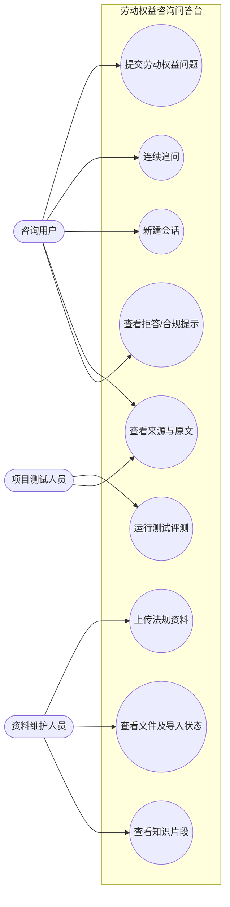
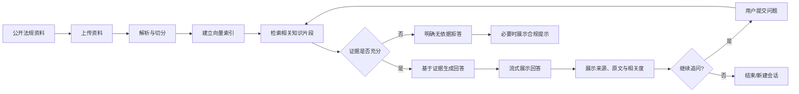
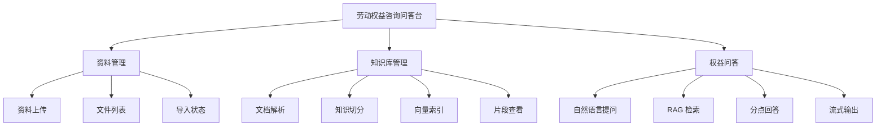
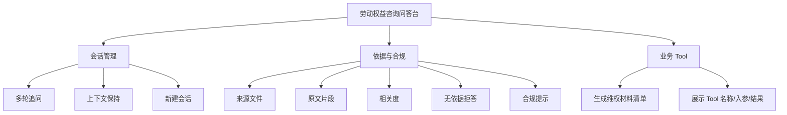
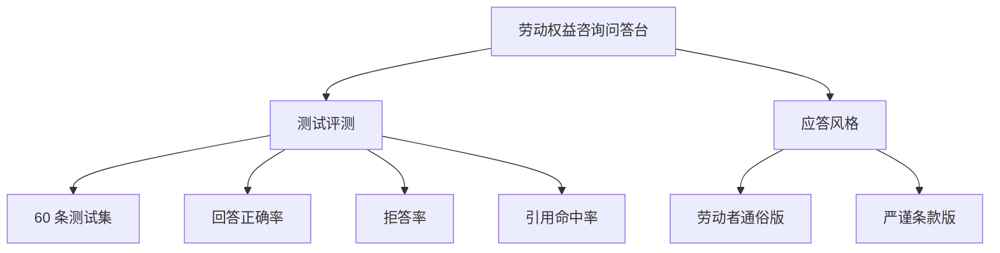
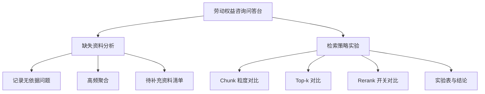

# 劳动权益咨询问答台——需求文档

---

## 1. 引言

### 1.1 项目背景（问题定义）

劳动者在工资、加班、离职、社保、工伤等场景中经常遇到权益判断问题，但劳动法规条款数量多、表达专业、适用条件复杂，普通使用者往往难以快速定位与自身问题直接相关的规定。传统搜索方式通常只能返回大量网页或完整法规文件，使用者仍需要自行阅读、比对并判断条款是否适用。

本项目建设“劳动权益咨询问答台”，将公开的劳动法规与政策资料整理为可检索知识库。用户使用自然语言描述问题后，系统从知识库中检索相关法规片段，并基于检索到的证据组织回答，同时展示来源文件、原文片段和相关度。对于知识库没有覆盖、检索结果不足或相关度过低的问题，系统必须明确说明“未找到足够依据”，不得仅依赖大模型常识生成看似合理但无法追溯的结论。

### 1.2 项目目标

1. 建立一个可导入公开劳动法规与政策资料的本地知识库。
2. 支持 PDF、Word、TXT 等资料的上传、解析、切分、索引与状态查看。
3. 支持自然语言劳动权益问答，并返回结构化回答。
4. 每个回答均能够追溯到具体来源文件和原文片段。
5. 支持不少于三轮的连续追问，能够理解依赖前文的指代。
6. 对无依据问题进行可靠拒答，并在涉及维权路径与时效时给出合规提示。
7. 建立 60 条标准化评测集，对回答正确率、无依据问题拒答率与引用命中率进行量化评测。
8. 支持“劳动者通俗版”和“严谨条款版”两种应答风格，并允许用户在页面切换。
9. 自动归纳高频无依据问题，形成“待补充资料”清单，辅助知识库持续完善。
10. 支持不同 Chunk 粒度、Top-k 与 Rerank 策略的检索对比实验，并输出量化结果与结论。

### 1.3 开发意义

本项目的开发意义主要体现在三个方面：

- **降低法规检索门槛**：用户不需要掌握法规名称、条款编号或专业检索语法，只需描述真实问题即可获取相关依据。
- **提高回答可解释性**：系统不只给结论，还同时展示引用来源和原文片段，便于用户自行核验。
- **训练可信 RAG 应用开发能力**：项目覆盖资料处理、向量检索、Prompt 约束、多轮会话、流式输出、Tool、评测等典型 AI 应用工程能力。

### 1.4 参考资料与术语说明

| 术语 | 说明 |
|---|---|
| RAG | Retrieval-Augmented Generation，检索增强生成。先从知识库检索证据，再由模型基于证据生成回答。 |
| Chunk | 文档切分后的最小知识片段，每个片段需保存来源文件名与片段序号等元数据。 |
| Embedding | 将文本转换为向量表示，用于计算问题与知识片段之间的语义相似度。 |
| Top-k | 一次检索返回的最相关知识片段数量。 |
| Prompt | 发送给大模型的业务提示词，用于约束角色、任务范围、输出格式和拒答规则。 |
| Tool | 由 LangChain 管理的业务工具。系统可根据问题触发工具，并展示工具名称、入参及执行结果。 |
| SSE | Server-Sent Events，服务端向浏览器持续推送文本数据的一种方式，可用于实现流式回答。 |
| 拒答 | 当知识库无可用证据时，系统明确说明无法依据当前资料回答，而不是自行补全内容。 |

---

## 2. 用户需求分析

### 2.1 系统使用对象

系统采用逻辑角色划分，不设置注册登录与复杂权限认证体系。

| 角色 | 身份说明 | 主要权限 | 主要操作 |
|---|---|---|---|
| 咨询用户 | 使用系统查询劳动权益问题的普通用户 | 使用问答与会话功能；查看回答依据 | 提交问题、连续追问、新建会话、查看来源、查看原文、查看合规提示 |
| 资料维护人员 | 负责准备与维护公开法规资料的项目使用者 | 使用资料与知识库管理功能 | 上传资料、查看导入状态、查看文件列表、查看知识片段、检查知识库内容 |
| 项目测试人员 | 对系统回答质量进行验证的项目成员 | 使用问答与评测功能 | 运行测试问题、记录正确率、检查拒答、检查来源引用 |

### 2.2 用户主要诉求

咨询用户最关心的是“回答是否和自己的问题相关、有没有法规依据、依据是否能看见、没有依据时系统会不会乱说”。资料维护人员最关心的是“资料能否成功导入、导入后是否被正确切分、每个片段能否追溯到原文件”。测试人员最关心的是“系统是否能稳定复现测试结果，并统计正确率、拒答率等指标”。

### 2.3 系统用例图

### 2.4 典型业务流程

### 2.5 典型使用场景

**场景一：查询加班工资问题。** 用户输入“公司要求周末加班但不给加班费怎么办”。系统检索知识库后返回适用情形、相关依据和处理建议，并在回答下方展示命中的法规文件、原文片段及相关度。

**场景二：连续追问。** 用户第一轮询问“试用期被辞退有没有补偿”，第二轮继续询问“那如果公司说我不符合录用条件呢”，第三轮询问“我需要准备什么材料”。系统需要结合前文理解“公司”“试用期被辞退”等指代，不应把第三轮当成完全独立问题。

**场景三：知识库外问题。** 用户询问与当前导入法规无关或证据不足的问题。系统应明确提示“当前知识库未找到足够依据”，不得由模型自行补全法律结论。

---

## 3. 功能需求分析

### 3.1 功能结构

系统功能由资料与知识库、权益问答与会话、依据与业务工具、质量评测与增强能力四部分组成。

**资料与知识库功能：**

**会话、依据与业务工具：**

**质量评测与应答风格：**

**缺失资料分析与检索策略实验：**

### 3.2 资料上传与文件列表

**输入：** PDF、DOC/DOCX、TXT 格式的公开劳动法规或政策资料。  
**处理：** 系统校验文件格式与基本可读性，保存文件，创建导入任务，执行文本解析、切分和索引。  
**输出：** 文件名、文件类型、导入状态、导入时间、片段数量；失败时展示失败原因。

核心需求：

1. 支持 PDF、Word、TXT 文件上传。
2. 文件列表至少展示文件名与导入状态。
3. 导入状态应区分处理中、成功、失败。
4. 不支持的格式应在进入知识库处理前拦截。
5. 同一文件失败后应允许重新导入。

### 3.3 法规知识库构建

**输入：** 已上传且解析成功的法规文本。  
**处理：** 文本清洗、分段、切块、生成元数据、Embedding、建立向量索引。  
**输出：** 可供检索的知识片段以及与原始文件的映射关系。

每个 Chunk 至少保存：

- 来源文件 ID；
- 来源文件名；
- 片段序号；
- 原文内容；
- 向量索引键或对应关系。

知识片段需按文件归组展示，使用者可查看单个片段的完整原文。

### 3.4 权益问答

**输入：** 用户自然语言问题、当前会话 ID。  
**处理：** 结合会话历史理解问题，检索知识库，判断证据质量，组装 Prompt，生成回答。  
**输出：** 分点回答、依据、处理建议、来源信息及必要的合规提示。

回答统一采用以下结构：

1. **结论/适用情形**；
2. **依据条款或依据说明**；
3. **处理建议**；
4. **合规提示（适用时）**。

系统应通过流式方式逐段展示回答，避免用户长时间等待完整结果后才看到内容。

### 3.5 来源展示

每次回答下方展示命中的知识片段，至少包含：

- 来源文件名；
- 片段序号；
- 原文片段；
- 相关度；
- 展开/收起操作。

来源信息必须由检索结果直接返回，不允许模型自行编造文件名或引用内容。

### 3.6 多轮会话与新建会话

1. 同一会话内保存历史消息。
2. 连续对话不少于三轮时，系统仍应正确理解“那”“这种情况”“公司”等依赖前文的指代。
3. 新建会话后生成新的会话 ID。
4. 新会话不得继承上一会话的历史上下文。
5. 页面应明确区分当前会话与新建会话操作。

### 3.7 无依据问题处理与合规提示

当出现以下情况之一时进入拒答逻辑：

- 知识库无检索结果；
- 检索结果与问题相关度过低；
- 检索片段无法支持用户问题中的关键结论。

系统应明确输出类似“当前知识库未找到足够依据，无法据此给出确定结论”的说明。不得让大模型仅凭预训练知识补全法律答案。

涉及具体维权路径、仲裁时效等内容时，必须附加“请咨询当地劳动监察部门或法律援助机构”等合规提示。

### 3.8 业务 Tool

本项目选择实现“**生成维权材料清单**”工具。

**输入：** 争议类型、问题简述（例如欠薪、加班工资、解除劳动关系等）。  
**处理：** 根据预设业务规则生成维权所需材料清单，并返回结构化结果。  
**输出：** 工具名称、调用入参、执行结果（材料清单及说明）。

页面需要展示 Tool 的名称、入参和执行结果，以体现 Tool 调用过程的可观察性。

### 3.9 测试与评测

项目正式评测集固定为 **60 条**，其中：

- 40 条知识库内有依据问题，覆盖工资、加班、试用期、解除劳动关系、社保、工伤、劳动仲裁等主要主题；
- 20 条知识库外或当前资料不足的问题，用于验证拒答边界；
- 其中至少 10 条设计为多轮追问或指代消解场景；
- 其中至少 10 条要求命中特定法规或特定 Chunk，用于验证引用命中率。

评测至少统计：

1. **回答正确率** = 正确回答的库内问题数 / 库内问题总数；
2. **拒答率** = 正确拒答的库外问题数 / 库外问题总数；
3. **引用命中率** = 命中期望来源的库内问题数 / 设置期望来源的库内问题总数；
4. **多轮理解通过率** = 正确理解上下文的多轮测试数 / 多轮测试总数；
5. **合规提示命中率** = 应出现合规提示且实际出现的用例数 / 应提示用例总数。

每次评测需要保存：测试问题、问题类型、期望要点、期望来源、系统回答、是否正确、是否拒答、实际引用、是否命中期望引用、应答风格、检索策略配置、运行时间和备注。评测结果以表格形式展示，并支持按问题类型、主题和运行批次查看。

### 3.10 应答风格切换

系统提供两种应答风格，用户可在问答页面切换，默认使用“劳动者通俗版”。切换风格只影响表达方式，不改变检索证据、拒答规则和引用来源。

| 风格 | 适用对象 | 表达要求 |
|---|---|---|
| 劳动者通俗版 | 普通劳动者 | 少用专业术语，先给结论，再解释理由；必要术语用括号解释；处理步骤清晰可执行 |
| 严谨条款版 | 教师验收、专业学习、资料核验 | 使用更正式的法律表达，突出适用条件、依据范围和限制，不夸大证据能够支持的结论 |

功能要求：

1. 页面提供明显的风格切换控件；
2. 每次提问将当前 `answer_style` 传给后端；
3. 后端使用独立 Prompt 模板或模板参数控制风格；
4. 无论使用何种风格，来源信息均由 Retriever 结果生成，不由模型虚构；
5. 会话内允许切换风格，切换后仅影响后续回答。

### 3.11 高频无依据问题与待补充资料清单

系统对进入“无依据拒答”的问题进行记录，并对问题进行主题归类与频次统计，形成“待补充资料”清单，帮助资料维护人员发现知识库缺口。

每条缺失项至少包括：

- 归一化问题或主题；
- 典型原始问题；
- 出现次数；
- 最近出现时间；
- 系统判定的缺失主题；
- 可能需要补充的资料方向；
- 当前状态（待补充 / 已补充 / 忽略）；
- 相关的拒答记录数量。

页面支持按出现次数排序，并允许资料维护人员把某项标记为“已补充”或“忽略”。当新资料导入后，可再次运行相关测试问题验证缺口是否关闭。

### 3.12 检索策略对比实验

系统实现可重复的检索策略对比实验，用于验证不同参数对引用命中率和问答效果的影响。至少对以下变量进行比较：

1. **Chunk 粒度**：如 400 / 600 / 800 中文字符；
2. **Top-k**：如 3 / 5 / 8；
3. **Rerank**：关闭 / 开启。

实验过程要求：

- 使用同一批评测问题进行横向对比；
- 保存每组实验的参数快照；
- 统计回答正确率、拒答率、引用命中率及平均检索耗时；
- 输出实验对比表，并给出最优配置和实验结论；
- 实验结果不可覆盖，需以批次方式留存，便于验收展示。

实验基线配置为 `chunk_size=600`、`chunk_overlap=100`、`top_k=5`、`rerank=false`；最终运行配置依据实验结果确定。

### 3.13 系统功能范围

| 功能类别 | 功能内容 | 范围状态 |
|---|---|---|
| 资料与知识库 | 资料上传、解析、切分、索引、文件列表、Chunk 查看 | 项目范围内 |
| 智能问答 | RAG 问答、来源展示、流式输出、多轮追问、新建会话 | 项目范围内 |
| 可信控制 | 无依据拒答、合规提示、业务 Tool | 项目范围内 |
| 质量评测 | 60 条评测集、正确率、拒答率、引用命中率 | 项目范围内 |
| 应答风格 | 劳动者通俗版、严谨条款版 | 项目范围内 |
| 缺失知识分析 | 高频无依据问题归纳、待补充资料清单 | 项目范围内 |
| 检索实验 | Chunk、Top-k、Rerank 检索对比实验 | 项目范围内 |
| 非项目功能 | 注册登录、复杂权限、在线支付、真实法律服务下单 | 不在项目范围 |

### 3.14 需求可追溯矩阵

| 功能要求 | 需求落点 | 验收方式 |
|---|---|---|
| PDF/Word/TXT 上传与列表 | 3.2 | 分别上传 3 类文件并查看状态 |
| RAG 构建与 Chunk 追溯 | 3.3 | 查看 Chunk 与来源文件映射 |
| 问答、来源、流式输出 | 3.4、3.5 | 实际提问并观察 SSE 与 Sources |
| 三轮以上多轮追问 | 3.6 | 连续至少三轮指代测试 |
| 新建会话隔离 | 3.6 | 新会话提问不得读取旧历史 |
| 无依据拒答与合规提示 | 3.7 | 库外题、时效/维权题验证 |
| LangChain Tool | 3.8 | 页面展示名称、入参、结果 |
| 60 条测试与三项核心指标 | 3.9 | 展示评测集和量化报表 |
| 双应答风格 | 3.10 | 同一问题切换两种风格对比 |
| 高频无依据问题归纳 | 3.11 | 连续制造缺失问题并查看清单 |
| 检索策略对比实验 | 3.12 | 展示参数、实验表和最优配置结论 |

---

## 4. 非功能需求分析

### 4.1 性能与实时性

1. 普通页面操作（文件列表、会话创建、片段列表）在本地环境中应具有明显可接受的交互响应，不出现长时间无反馈。
2. 问答采用流式输出，模型开始返回内容后应尽快把首段内容推送到前端。
3. 对单次检索仅返回有限数量的 Top-k 片段，避免无意义地把大量文档放入模型上下文。
4. 文档导入属于相对耗时操作，页面必须显示处理中状态，避免用户误认为上传失败。

### 4.2 稳定性与可靠性

1. 单个文件导入失败不得导致整个服务退出。
2. 模型服务不可用、向量索引缺失、文件解析失败时必须返回明确错误信息。
3. 数据库中的文档状态、会话与消息记录应保持一致。
4. 新建会话必须实现上下文隔离，避免不同会话互相污染。
5. 引用来源必须与实际检索命中片段一致。

### 4.3 安全性

1. 仅允许上传规定的文档类型，并对扩展名与实际处理方式进行校验。
2. 上传文件名应进行安全处理，防止目录穿越等问题。
3. API Key、模型地址等敏感配置不得写死在前端代码或提交到公开仓库，应通过环境变量或配置文件管理。
4. Prompt 必须明确“只能依据检索证据回答”的边界，降低无依据生成风险。
5. 页面不得把系统内部密钥、完整异常堆栈等敏感信息直接返回给普通用户。
6. 项目定位为劳动权益咨询辅助，不应宣称替代律师或行政机关作出正式法律结论。

### 4.4 易用性

1. 问答页面应突出问题输入框、发送按钮和会话区域。
2. 来源信息默认可折叠，避免法规原文影响主要回答的阅读。
3. 文件导入状态使用清晰文字展示，不仅依赖颜色区分。
4. 错误提示应说明用户下一步可以采取的操作，例如重新上传、检查格式或稍后重试。
5. 新建会话入口应明显，防止用户误把不同事项放在同一上下文中。

### 4.5 兼容性

1. 后端运行环境以 Python 3.11 为基准。
2. 前端采用现代浏览器兼容方案，主要面向最新版 Chrome、Edge、Safari。
3. 支持 PDF、DOC/DOCX、TXT 作为知识库输入格式。
4. 项目应可按照 README 在新的开发环境中独立启动。

### 4.6 可维护性

1. Prompt 集中管理，不散落在接口代码中。
2. 文档解析、知识库、会话、问答、Tool、评测模块应分层组织。
3. 接口使用统一响应结构与统一错误码。
4. 关键参数（Chunk 大小、Overlap、Top-k、阈值、模型名、Rerank 开关与应答风格）应配置化，用于参数调优与实验复现。
5. 评测批次与检索实验配置应可追溯，确保实验结果可重复。
6. 高频无依据问题的归纳逻辑应独立于问答主流程，避免统计功能影响正常咨询。

---

## 5. 验收判定

项目验收覆盖本文件规定的全部功能要求，验收条件如下：

1. 能成功导入 PDF、Word、TXT 三类真实公开劳动法规/政策资料，并完成解析、切分与索引建立；
2. 能完成“资料导入 → 提问 → 检索 → 回答 → 来源展示”的完整闭环；
3. 回答包含适用情形、依据与处理建议，并展示真实来源文件、Chunk、原文和相关度；
4. 回答采用流式方式呈现；
5. 能完成不少于三轮的连续追问并正确理解指代；
6. 新建会话后不继承上一会话历史；
7. 对知识库外或证据不足的问题能够明确拒答，不使用模型常识补全法律结论；
8. 涉及维权路径或时效时展示合规提示；
9. “生成维权材料清单” Tool 可通过 LangChain Tool 机制调用，并在页面展示名称、入参和结果；
10. 正式测试集固定为 60 条，并展示回答正确率、拒答率、引用命中率等量化指标；
11. 页面可在“劳动者通俗版”和“严谨条款版”之间切换，且两种风格均遵守相同证据边界；
12. 系统能记录并聚合高频无依据问题，生成“待补充资料”清单；
13. 完成 Chunk 粒度、Top-k、Rerank 至少三类检索策略变量的对比实验，输出对比表、指标和结论；
14. 异常输入、模型不可用、索引缺失等场景具有明确错误反馈；
15. 项目源码、知识库公开资料、评测数据、实验结果、配置样例、README 与设计文档形成完整交付包，并可按 README 独立启动。

---

## 6. 最终交付物清单

1. 前后端完整源码；
2. 公开劳动法规/政策知识库资料；
3. SQLite 数据库结构或初始化脚本；
4. FAISS 索引生成方式及数据持久化说明；
5. `.env.example` 与配置说明；
6. 60 条测试用例文件及评测结果；
7. 检索策略实验配置与结果文件；
8. 高频无依据问题与待补充资料清单导出结果；
9. README 启动与演示说明；
10. 需求文档与系统设计/项目开发文档；
11. 可用于验收演示的示例法规、示例会话和关键页面截图。
